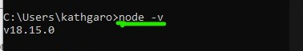
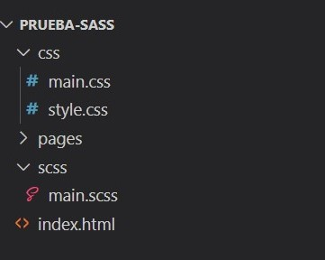
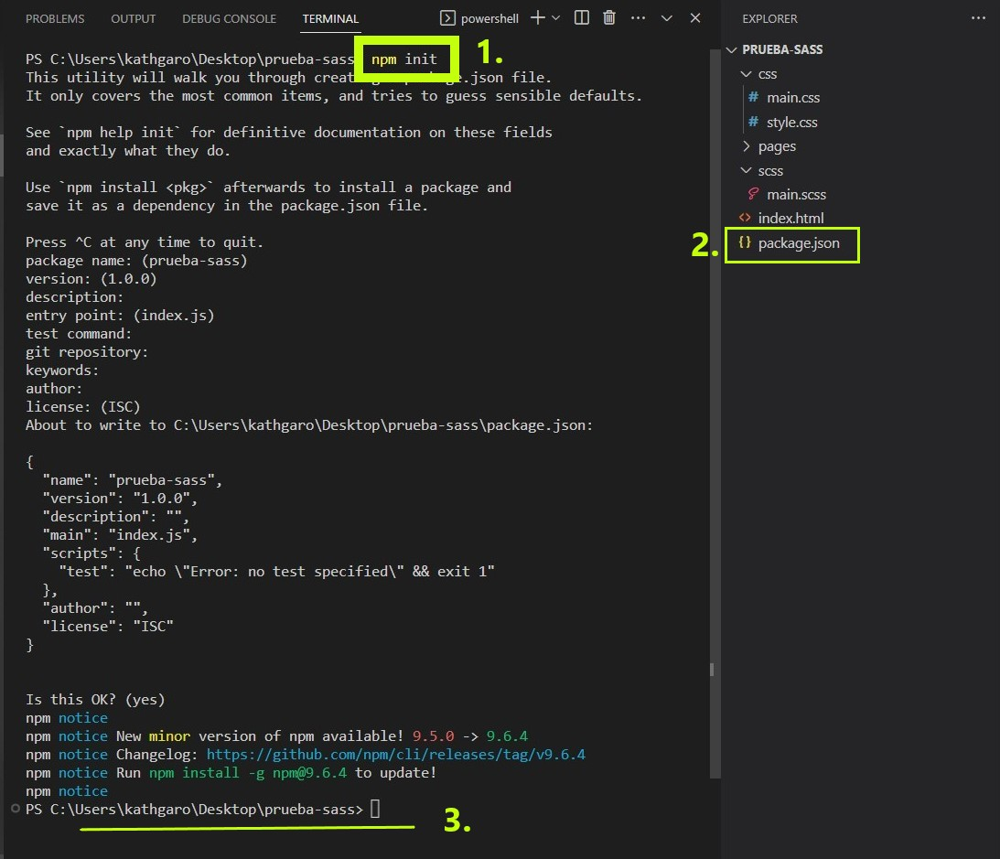
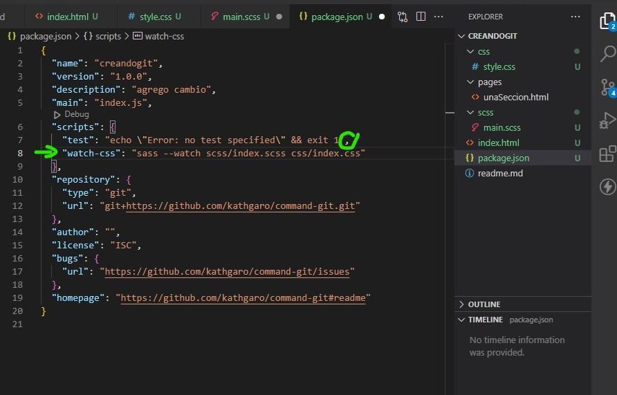
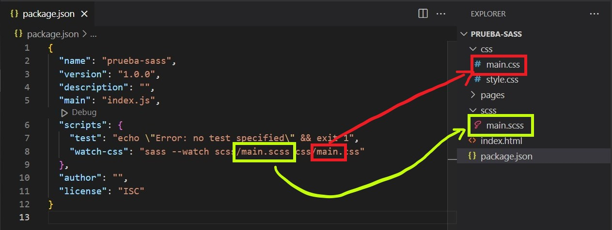
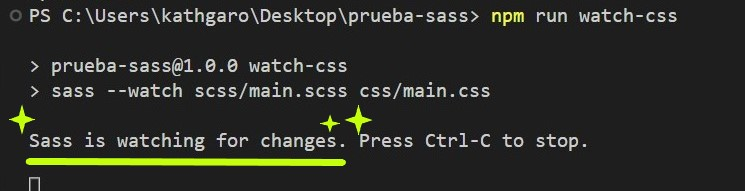

# Pasos para instalar SASS
IMPORTANTE: 
- Antes de iniciar con los siguientes pasos debes tener instalado *node.js* sino lo tienes instalado, debes descargarlo desde este link:
https://nodejs.org/en

- Una vez lo descargues, abre el instalador y dale *next* hasta el final.
- Luego, abre tu terminal y para chequear que este correctamente instalados agrega este comando:
```
node -v
```
Te devolverá algo asi como la siguiente imagen:


#

## 1. ¡VAMOS A VISUAL CODE! - Crear carpetas y archivos

1. Abre tu proyecto en visual code.
2. Crea una carpeta "scss" y dentro un archivo llamado "main.scss"
3. Dentro de la carpeta "css" vamos a crear a "main.css" que va a ser donde vamos a compilar.

👇 *Imagen de referencia* 👇



💥IMPORTANTE: Este ejemplo es teniendo en cuenta que vas a integrar *sass* en tu proyecto, por eso, dejamos a "style.css" para tener un back-up de los estilos que ya creaste.

#

## 2. Configurar sass en nuestro proyecto.

- Abrimos la terminal e ingresamos el siguiente comando *(Ref: Imagen punto 1):*
```
 npm init 
```
- Nos aparecerá un mensaje largo y debes hacer "enter" hasta que te devuelva la linea de comando nuevamente *(Ref: Imagen punto 3)*

- Si todo esta bien, notarás que en tu proyecto se creó un archivo llamado "package.json" *(Ref: Imagen punto 2)*



#

## 3. Modificamos el json
- Nos aparecerá el siguiente archivo en el que vamos a buscar la "linea 7" y agregamos una *"coma"* ( , ) al final *(Ref. imagen)*




- Luego, hacemos "enter" y agregamos el sieguiente comando:
```

"watch-css": "sass --watch scss/main.scss css/main.css"

```

💥IMPORTANTE: *La ruta de los archivos deben respetarse como en la imagen para que compile correctamente*



- Para finalizar con la configuración, guarda los cambios *ctrl+S*

#

## 4. Iniciando sass
 - En la terminal agregamos el siguiente comando y le damos "enter":
 ```
npm run watch-css
 ```
💥IMPORTANTE: La referencia *watch-css* es por la configuración que realizamos, si le agregas otro nombre, debes modificar el comando. 

 *(Ref. imagen)*

 


#

 ## 5. SASS 
- Si seguiste todos los pasos en terminal te aparecerá el siguiente mensaje:

 

#

 ## 📌Este ejemplo hace referencia a como funcionaría sass cuando está activado.
- Ten encuenta lo siguiente:
1. Debes escribir en el scss y realizar el "nesting" si esta correctamente realizado, se compilará. Para esto, debes guardar el archivo scss y verás el resultado en el css. No compila de forma automática.

2. Se va a crear una archivo nuevo con formato *.map*

3. Para usar *sass* SIEMPRE debes tener la terminal abierta y con sass corriendo.

 


#
#

### 🎁 Ya tienes todo listo para empezar a trabajar en sass 💪 
 
