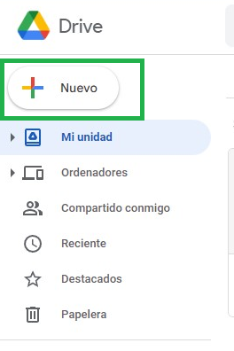
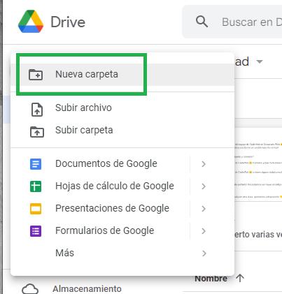
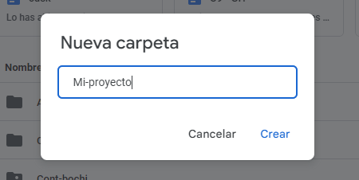
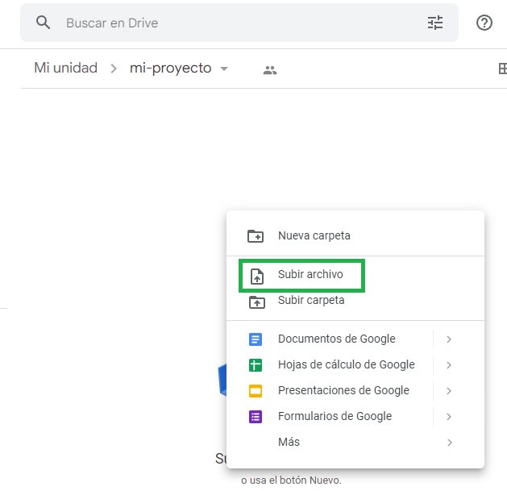
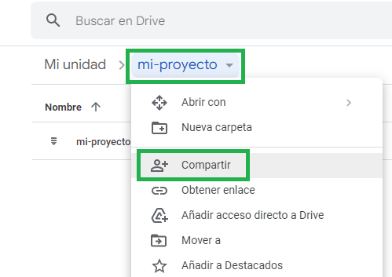
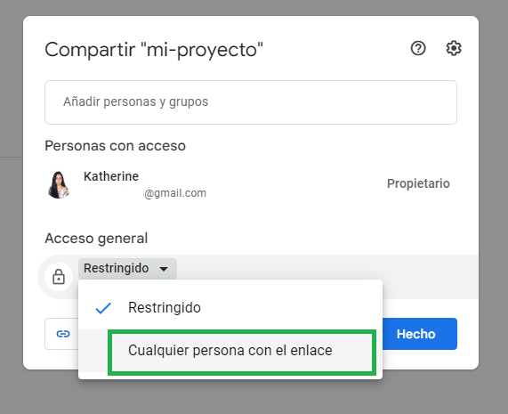
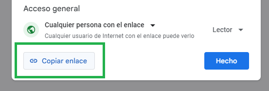

# Pasos para crear link de drive

## 1. Iniciando una carpeta
Al estar en "DRIVE" de la mano izquierda verás este botón. Hace clic donde dice “Nuevo” como en la imagen:

## 2. Crear carpeta
Ahora se desplagrá un menú en el cual seleccionaremos haciendo clic en “Nueva carpeta”

## 3. Nombre de carpeta
Nos aparecerá esta ventana, y es donde debemos ingresar el nombre de nuestra carpeta y luego debemos hacer clic en “crear”

## 4. Subimos archivo
 Subi tu archivo .rar/.zip (hace clic derecho y te aparecerá el siguiente menú, elegí la opción "subir archivo"
 
 

 Luego hace clic en el nombre de tu carpeta como en la imagen y se desplegará un menú, hace clic en “compartir”

## 5. Modificamos el acceso
Ahora elegimos la opción "Cualquier persona con el enlace" como se indica en la imagen:

## 6. ¿Como obtener el enlace?
Por último, hacemos clic en “copiar enlace” y lo pegamos en el item de plataforma.

