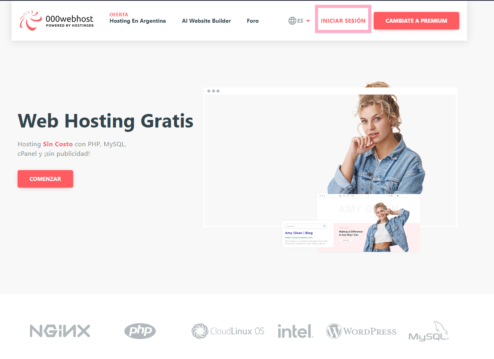
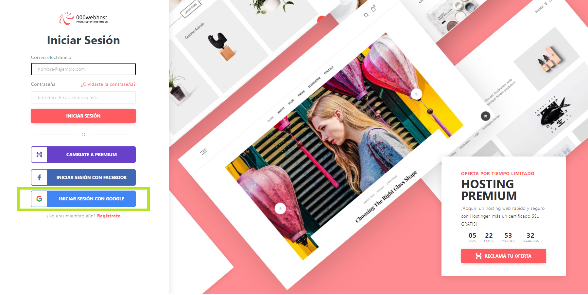
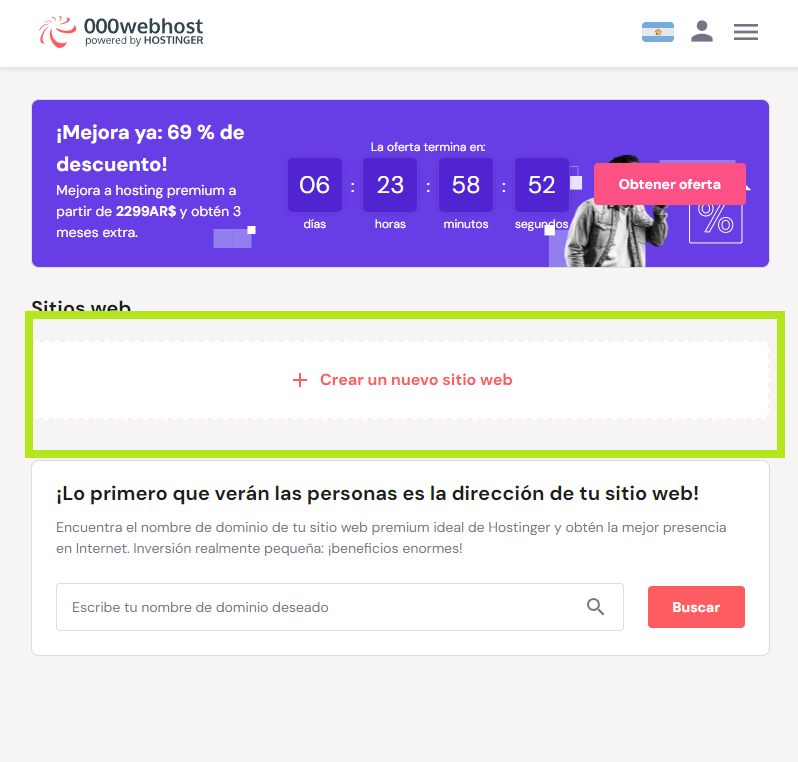
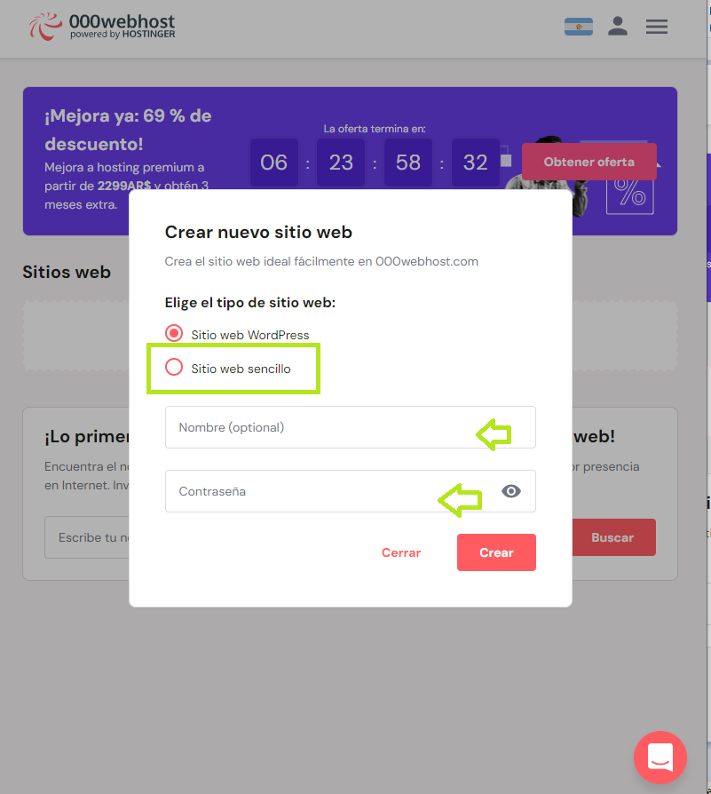
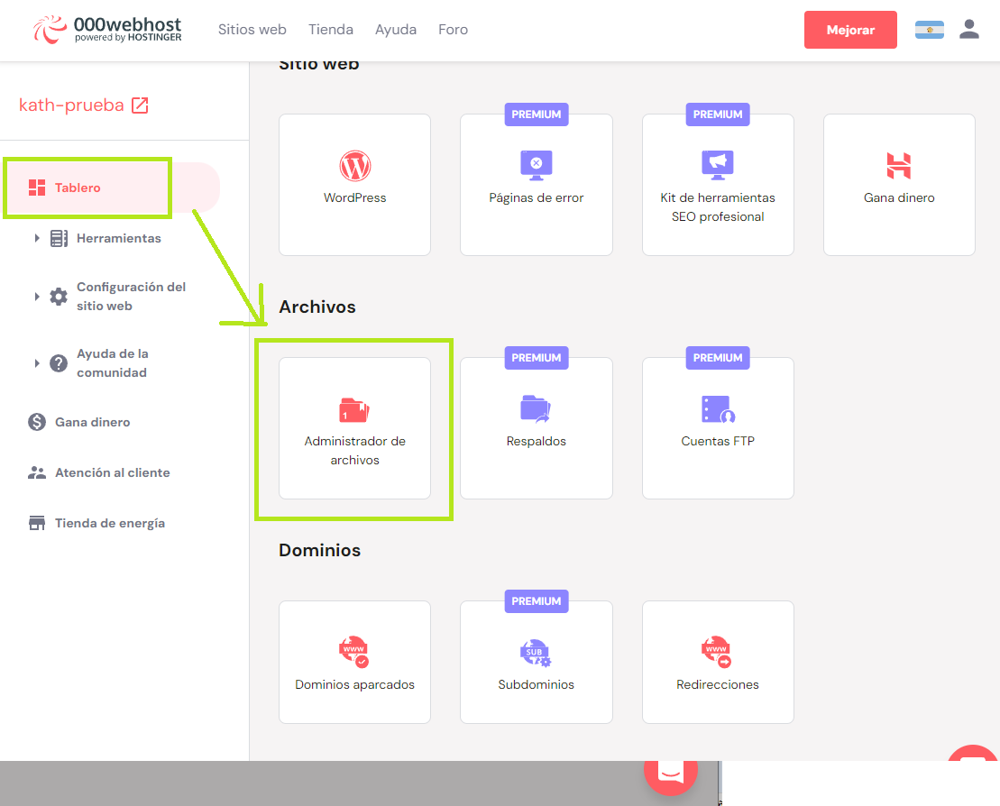
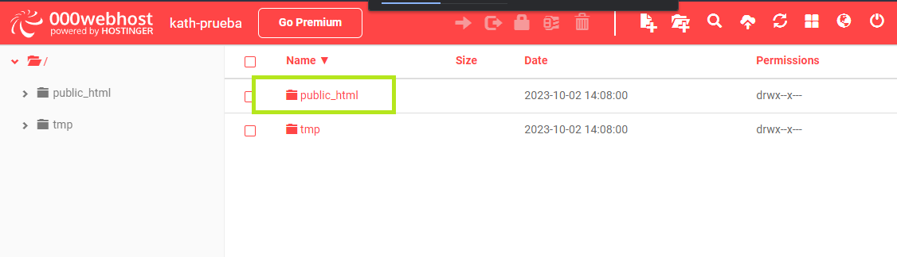
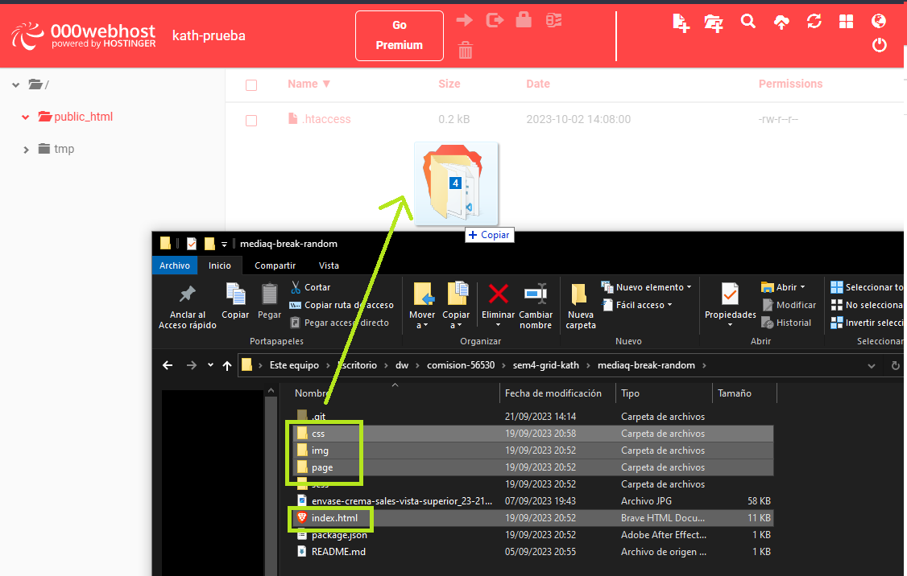
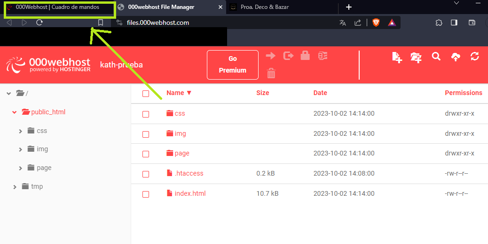
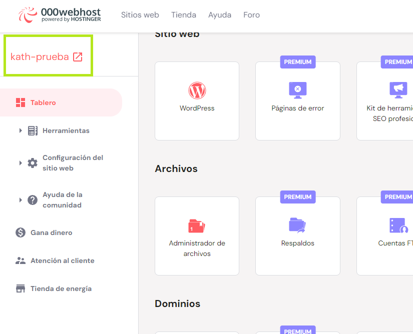

# 000WEBHOST - Subida 🚀

## 1. Entrar a Webhost
Ingresa al siguiente link:
https://ar.000webhost.com/

Luego, selecciona el item de "iniciar sesion"

## 2. Iniciar sesion
Loggeate con tu mail:

## 3. Crear proyecto
Al ingresar, te aparecerá este botón para poder "crear un nuevo sitio web", haz clic ahí

## 4. Configuración
Luego, completa los siguientes espacios que están resaltados a continuación: (Anota ese nombre y contraseña)

Cuando finalizas, dale clic en "crear"

## 5. Tablero de configuración
En este espacio de "Tablero" encontrarás de la mano derecha muchos recuadros, busca en la sección "Archivos" el icono de 📂 "Administrador de archivos"
Al encontrarlo haz clic ahí

## 6. Administrador de archivos
En este espacio, vamos a ingresar a la carpeta "public_html" que es donde vamos subir nuestros archivos:

## 7. Carpeta Public
Selecciona desde tu carpeta local **solo los archivos que necesitas para que tu proyecto se muestre**, es decir, los html, css y material gráfico (sean imágenes, videos, tipografías).
Una vez seleccionados, arrastralo hacia la carpeta "public" en 000webhost

Ejemplo:

## 8. Ya casi terminamos!
Como resultado te aparecerá algo así, es decir, los archivos y carpetas de tu proyecto.
Una ves esté todo cargado, vuelve a la pestaña de "Cuadro de mandos"

Ejemplo:

## 9. Paso final ✨
Al volver a panel principal encontraremos este enlace, ubicado en la barra izquierda abajo del logo. Ahí tendrás el link para ver tu web. En mi caso se llama "kath-prueba"
Haz clic ahí, para ver tu proyecto 😉

Ya tenes tu proyecto en línea 🙌

Si tenes alguna consulta podes escribirme 💌 [Ayuda](https://www.instagram.com/altoremolp/?hl=es)

