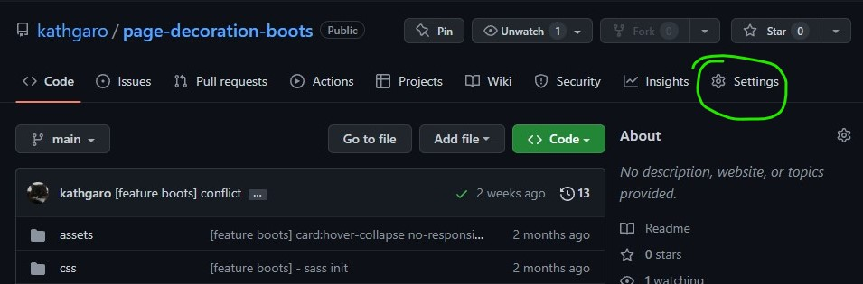
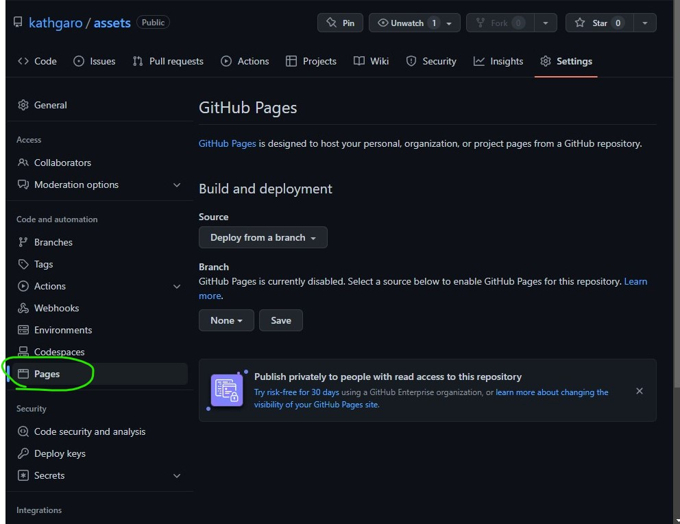
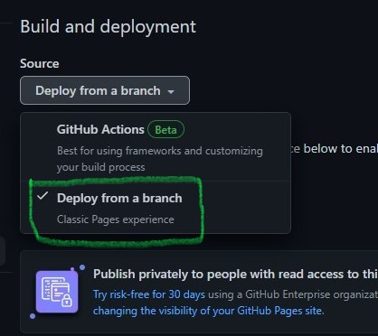
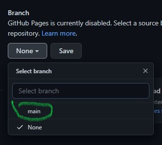
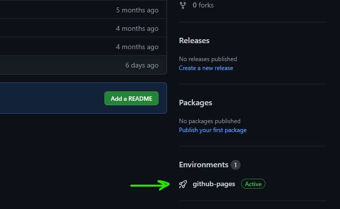

# Pasos para activar github - page

## 1. Seleccionar "Settings"
En tu repositorio revisa el menu y encontrarás un item con el nombre de "settings" 

## 2. Seleccionar "pages"
Ahora revisamos el menu del lado izquierdo y hacemos clic en el item "pages" el cual se mostrará asi:

## 3. Deploy
Veamos el apartado que dice "Build and deployment" > Source: Tendrás un botón que al hacer clic se despliega y debemos elegir el siguiente item:

## 4. Elegir rama
Ahora, veamos el apartado de "Build and deployment" > Branch: Tendrás un botón que al hacer clic se despliega y debemos elegir la rama que queremos activar en este caso seria "main"

## 5. Guardar y link de pages
Luego hacemos clic donde dice "Save" y en unos minutos aparecerá el link de nuestro pages.

## 6. Asi debe aparecer en nuestro repo
Actualiza y revisa tu repositorio, debe aparecer el  link hacia github-page!

